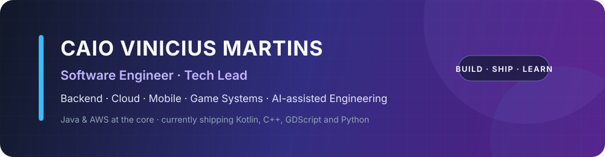
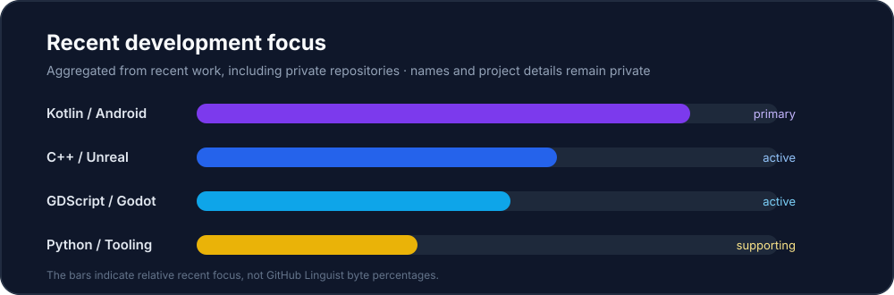

<p align="center">
  
</p>

<p align="center">
  <strong>Backend systems · Cloud architecture · Mobile · Game systems · AI-assisted engineering</strong>
</p>

---

### 👨‍💻 About me

I'm a software engineer and tech lead with a strong background in **Java**, enterprise backend systems and **AWS**. My work spans architecture, implementation, delivery and technical leadership — from legacy modernization and distributed systems to native Android apps, game prototypes and agentic development workflows.

Today I'm especially interested in building software where **architecture, product decisions and AI-assisted engineering** meet.

### 🚀 What I'm working with lately

<p>
  
  
  
  
  
  
</p>

<p align="center">
  
</p>

> The chart above represents **recent development focus**, including work in private repositories. It is intentionally aggregated: private repository names and project details are not exposed, and the bars are not presented as exact GitHub Linguist byte percentages.

### 🧱 Core engineering stack

<p>
  
  
  
  
</p>

<p>
  
  
  
  
  
</p>

<p>
  
  
  
</p>

### 🧭 Engineering areas

```text
Backend & Architecture   Java · Spring Boot · Micronaut · DDD · Clean Architecture
Cloud                    AWS · Serverless · Event-driven systems · Infrastructure as Code
Mobile                   Kotlin · Android · Jetpack Compose · native rendering
Game Development         C++ · Unreal Engine · GDScript · Godot
Data & Integration       PostgreSQL · MySQL · DynamoDB · Redis · REST · SOAP · WebSocket
AI Engineering           Coding agents · agentic workflows · local LLMs · orchestration
Tooling & Automation     Python · Docker · GitHub Actions · Jenkins
```

### 🤖 AI-assisted engineering

I'm actively experimenting with **coding agents as part of the engineering workflow**, not only as autocomplete: planning, implementation, verification, code review, simulations and multi-agent orchestration.

The goal is the same as with any other engineering tool: **ship faster without giving up architecture, tests, observability or human validation**.

### 📊 GitHub activity

<p align="center">
  
</p>

<sub>The public GitHub stats card may not account for all private-repository activity. The recent-stack panel above is maintained separately so the profile reflects the technologies I'm actually using.</sub>

---

<p align="center">
  <strong>Build systems. Test assumptions. Ship software.</strong>
</p>
